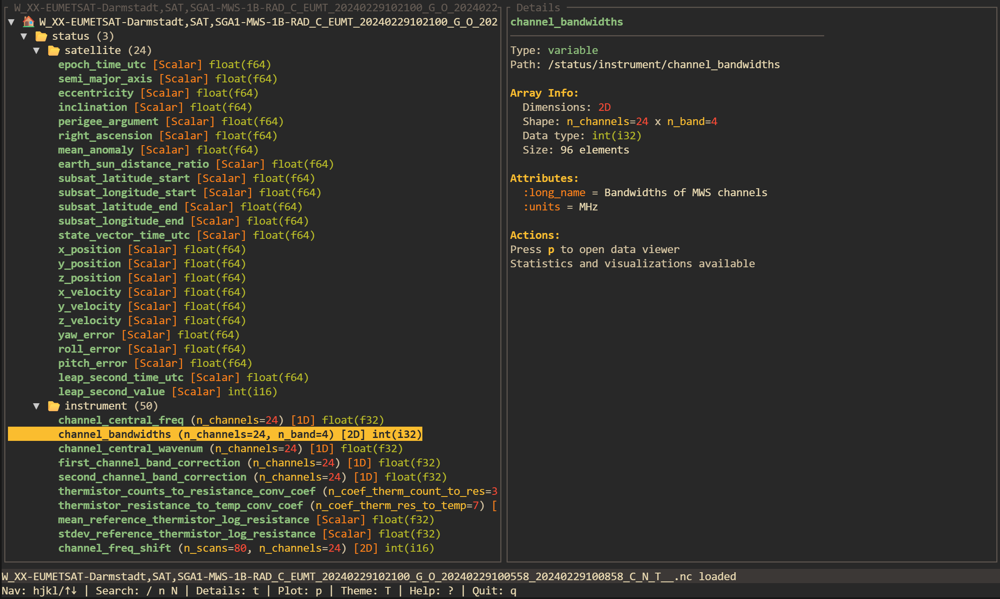
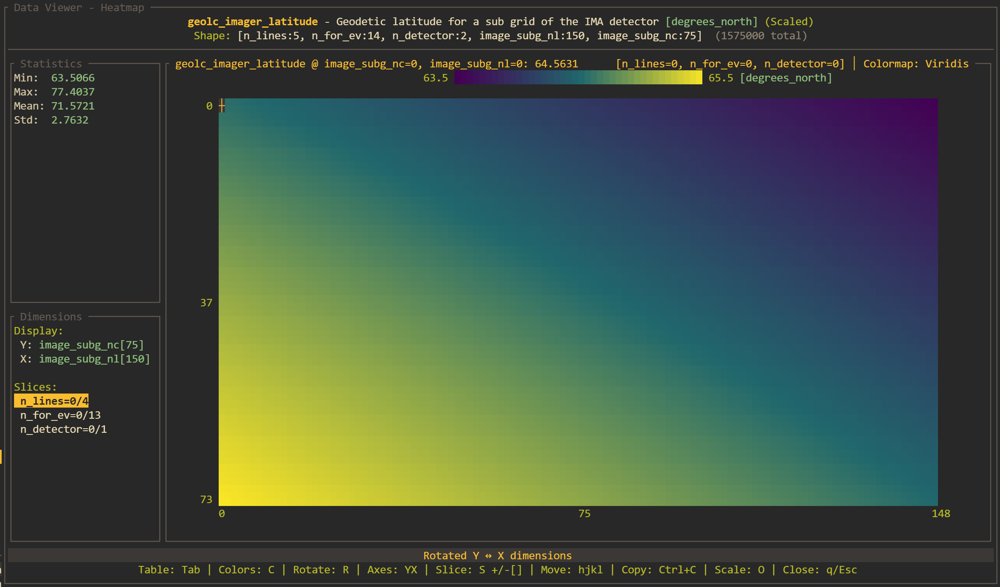
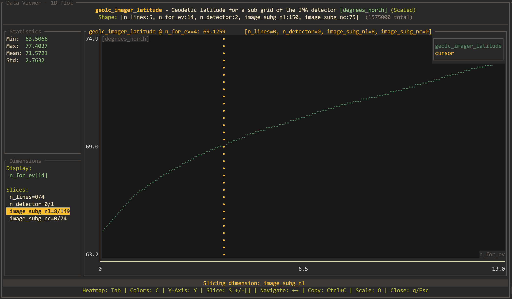

# Coriolis

[](https://github.com/jsilva/coriolis/releases)
[](https://opensource.org/licenses/MIT)
[](https://www.rust-lang.org/)
[](https://github.com/jsilva/coriolis/actions)

A fast, terminal-based NetCDF data explorer and viewer with vim-style navigation.

## Features

- **Fast NetCDF reading** — supports both classic and NetCDF-4/HDF5-backed files
- **Tree-based navigation** — browse groups, variables, dimensions, and attributes
- **Interactive data viewer** — table view, 1D plots, and heatmap visualizations
- **Multi-dimensional slicing** — navigate through 3D+ arrays with intuitive controls
- **Vim-style shortcuts** — feel at home with familiar keybindings
- **Dual themes** — light and dark themes
- **Portable binary** — single static binary for Linux (no runtime dependencies)
- **Low memory footprint** — efficient handling of large datasets
- **Clipboard support** — copy data and tree structures

## Screenshots

*Screenshots coming soon! Once you upload screenshots to your repository, add them here:*

```markdown



```

## Quick Start

### Installation

#### Download Pre-built Binary (Recommended)

Download the latest release for Linux:

**Linux (static binary, no dependencies required):**
```bash
# Download and extract
curl -L https://github.com/jsilva/coriolis/releases/latest/download/coriolis-linux-x86_64-musl.tar.gz | tar xz

# Make executable and move to PATH
chmod +x coriolis
sudo mv coriolis /usr/local/bin/
```

**Linux (dynamic binary):**
```bash
# Requires libnetcdf and libhdf5 installed on your system
curl -L https://github.com/jsilva/coriolis/releases/latest/download/coriolis-linux-x86_64.tar.gz | tar xz
chmod +x coriolis
sudo mv coriolis /usr/local/bin/
```

Or browse all releases: [https://github.com/jsilva/coriolis/releases](https://github.com/jsilva/coriolis/releases)

#### Using Cargo

```bash
cargo install coriolis
```

#### From Source

```bash
# Clone the repository
git clone https://github.com/jsilva/coriolis.git
cd coriolis

# Build and install
cargo build --release
sudo cp target/release/coriolis /usr/local/bin/
```

### Usage

```bash
# Open a NetCDF file
coriolis path/to/data.nc

# Open a directory (file browser mode)
coriolis path/to/directory/

# Enable debug logging
coriolis data.nc --log debug.log
```

## Keyboard Shortcuts

### Browser Navigation

| Key | Action |
|-----|--------|
| `j` / `↓` | Move down |
| `k` / `↑` | Move up |
| `l` / `→` | Expand node |
| `h` / `←` | Collapse node |
| `gg` | Go to top |
| `G` | Go to bottom |
| `Ctrl+f` | Page down |
| `Ctrl+b` | Page up |
| `/` | Search |
| `n` / `N` | Next / Previous match |
| `p` | Open data viewer |
| `t` | Toggle preview panel |
| `T` | Cycle theme |
| `c` | Copy tree structure |
| `y` | Copy current node |
| `f` | Open file browser |
| `q` | Quit |

### Data Viewer

| Key | Action |
|-----|--------|
| `Tab` | Cycle view mode (Table → Plot → Heatmap) |
| `h/j/k/l` | Navigate / Pan |
| `Ctrl+u/d` | Page up / down |
| `s` | Select slice dimension |
| `+/-` or `PgUp/PgDn` | Change slice index |
| `y/x` | Cycle Y/X display dimension |
| `r` | Rotate (swap) Y/X dimensions |
| `o` | Toggle scale/offset (raw vs scaled data) |
| `c` | Cycle color palette (heatmap) |
| `Ctrl+c` | Copy visible data to clipboard |
| `Esc` / `q` | Close viewer |

## Building

### Requirements

- Rust 1.70 or newer
- For static Linux builds: `musl-tools` package

### Build Commands

```bash
# Development build
cargo build

# Release build (optimized)
cargo build --release

# Static Linux binary (portable, no dependencies)
rustup target add x86_64-unknown-linux-musl
PKG_CONFIG_ALL_STATIC=1 cargo build --release --target x86_64-unknown-linux-musl

# Run tests
cargo test

# Run lints
cargo clippy
```

**Or use the Makefile for convenience:**

```bash
make release        # Optimized build
make static         # Static Linux binary (includes setup)
make test           # Run tests
make install        # Install to /usr/local/bin (requires sudo)
make help           # Show all available targets
```

## Supported Platforms

| Platform | Status | Notes |
|----------|--------|-------|
| Linux | ✅ Fully supported | Static binary available |
| macOS | ⚠️ Build from source | Use `cargo install` or build locally |
| Windows | ⚠️ Build from source | Requires proper terminal emulator |

## Configuration

Coriolis currently requires no configuration files. All settings are controlled via command-line arguments and runtime keyboard shortcuts.

### Command-Line Options

```
USAGE:
    coriolis [OPTIONS] [FILE_OR_DIR]

ARGS:
    <FILE_OR_DIR>    Path to NetCDF file or directory

OPTIONS:
    --log <PATH>     Enable logging to file
    -h, --help       Print help information
    -V, --version    Print version information
```

## Contributing

Contributions are welcome! Feel free to:

- Report bugs or suggest features via [GitHub Issues](https://github.com/jsilva/coriolis/issues)
- Share your use cases

### Development Setup

```bash
# Clone and build
git clone https://github.com/jsilva/coriolis.git
cd coriolis
cargo build

# Run with a test file
cargo run -- path/to/test.nc

# Run tests
cargo test

# Check formatting and lints
cargo fmt --check
cargo clippy
```

## License

This project is licensed under the MIT License — see the [LICENSE](LICENSE) file for details.

## Acknowledgments

- Built with [Ratatui](https://github.com/ratatui-org/ratatui) for the terminal UI
- Uses the [netcdf](https://crates.io/crates/netcdf) crate for data access
- Color schemes inspired by [Gruvbox](https://github.com/morhetz/gruvbox)

## Releasing (For Maintainers)

To create a new release with pre-built binaries:

1. Update the version in `Cargo.toml`
2. Commit the changes: `git commit -am "Bump version to vX.Y.Z"`
3. Create and push a tag: `git tag vX.Y.Z && git push origin vX.Y.Z`
4. GitHub Actions will automatically:
   - Build Linux binaries (static musl + dynamic gnu)
   - Create a draft release with binaries and checksums attached
   - Generate release notes with installation instructions
5. Edit the draft release on GitHub and publish it

The release workflow builds:
- `coriolis-linux-x86_64-musl.tar.gz` - Static Linux binary (no dependencies required)
- `coriolis-linux-x86_64.tar.gz` - Dynamic Linux binary (requires libnetcdf/libhdf5)
- `*.sha256` - SHA256 checksums for verification

## Why "Coriolis"?

The Coriolis effect is a fundamental concept in atmospheric and oceanic sciences — fields that heavily rely on NetCDF for data storage and exchange. This tool aims to make exploring that scientific data as intuitive as the physical phenomena it represents ;).
